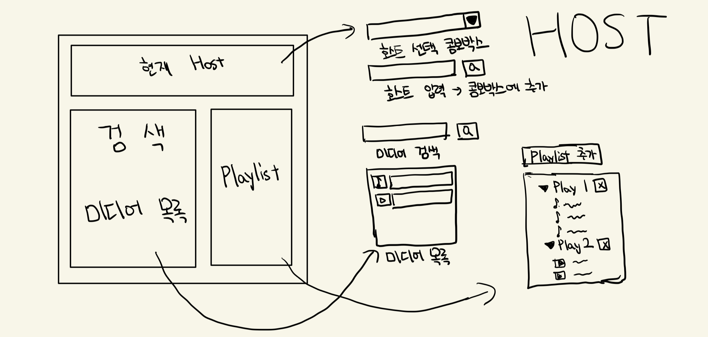
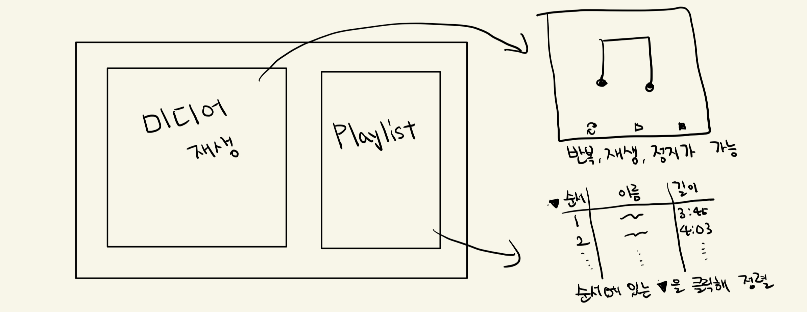

### 개요

Media Player는 사용자가 Drive 같은 외부 저장 공간에 있는 음악과 비디오를 재생하기 위해 만든 웹 앱입니다.

저장 공간의 저장 공간의 디렉터리를 포함한 호스트를 입력하면 미디어 파일의 링크를 정리해서 파일명으로 페이지에 표시하고, 재생하고 싶은 미디어 파일을 선별해서 플레이리스트를 만들 수 있습니다.

### 와이어프레임

처음 앱에 진입하면 홈 화면이 나타나고 다음과 같은 영역이 있습니다.
1. 호스트 영역: 미디어가 있는 디렉터리를 포함한 호스트를 입력해서 미디어의 데이터를 얻습니다. 그 데이터는 DB로 만들어서 서버에 저장됩니다.
2. 미디어 목록 영역: 미디어 링크를 파일명으로 정리합니다. 목록의 상단에서 검색창을 통해 미디어를 찾을 수 있습니다. 목록에 있는 미디어를 클릭하면 재생 페이지로 이동합니다.
3. 플레이리스트 영역: 미디어 목록에서 플레이리스트를 생성하고 미디어 목록에 있는 미디어를 드래그 드랍으로 추가할 수 있습니다. 해당 플레이리스트를 클릭하면 재생 페이지로 이동합니다.

미디어 또는 플레이리스트를 클릭하면 재생 화면이 나타나고 다음과 같은 영역이 있습니다.
1. 음악 또는 영상 재생 영역: 미디어를 재생하기 위한 사이드 바가 아래에 있고, 음악의 경우 앨범의 표지가 위에 나타나며, 영상은 그대로 영상이 표시됩니다.
2. 플레이리스트 영역: 클릭했던 플레이리스트에 있는 미디어가 이 곳에 나타납니다. 단일 미디어를 클릭해서 이 페이지로 왔다면, 해당 미디어만 표시됩니다. 

### 기술 스택 및 도구

1. React 18.2.0과 TypeScirpt를 사용해서 개발
2. react-router-dom 6.22.3을 사용해 라우터를 생성
3. styled-component 6.1.8을 사용해 CSS 작성
4. 구글 스프레드시트를 사용해 DB 관리
5. react-player 2.15.1을 사용해 미디어 재생

### 기능

접근 권한이 있는 Drive의 호스트를 입력해 미디어 목록을 불러올 수 있습니다.

불러온 미디어를 플레이리스트 안에서 관리할 수 있습니다.

미디어를 원하는 방식으로 정렬 후 재생할 수 있습니다.